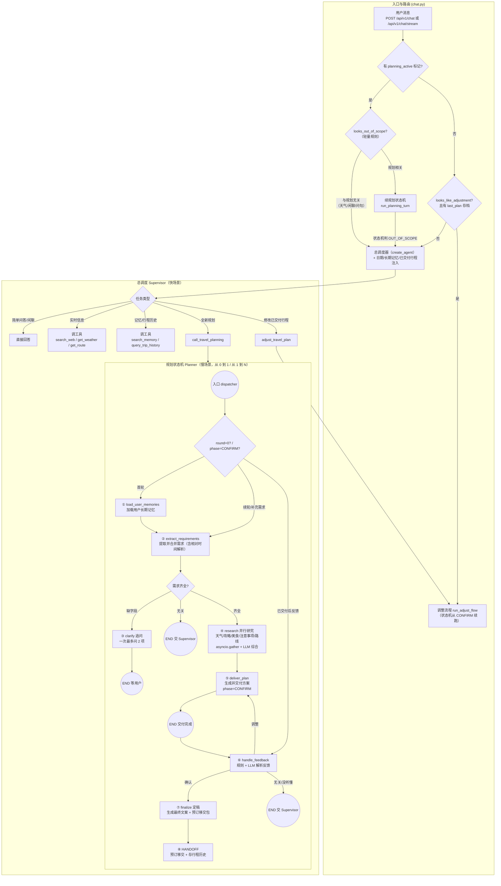

# **智能旅游助手架构设计文档**

### 版本: 3.0

### 日期: 2026-08-06

> 本文档已与当前代码（`backend/app`）同步。核心原则：**快场景用工具，慢场景用状态机。**

## 1. 概述

### 1.1. 项目目标

本文档旨在为"智能旅游助手"项目定义系统架构。该项目是一个面向 C 端用户的对话式 AI 应用，核心功能包括：

* **通用问答:** 解答用户关于旅游的常见问题，如天气、路线、景点攻略、住宿建议、交通方式等。
* **旅游行程规划:** 通过多轮对话收集用户个性化需求，调用搜索、天气、路线等工具完成信息研究，并生成可持续修改的结构化旅行计划。

### 1.2. 架构目标

本架构旨在实现以下关键目标：

* **卓越的用户体验:** 提供流畅、自然的对话体验，能够理解用户连续表达、混合意图及上下文指代，避免重复询问用户已经提供的信息；行程采用"交付式"语义，生成即交付、不追着用户确认。
* **高性能 & 低成本:** 普通问题优先使用轻量流程处理（规则直判 + Supervisor 直接回答），仅在复杂任务中调用 Agent、外部工具及多步骤规划状态机；研究阶段并行调用工具降低时延。
* **高可靠性 & 强鲁棒性:** 旅行规划过程具备明确、可持久化的状态，支持中断恢复、异常重试（熔断器 + 指数退避）和多轮续命；外部依赖（Redis / PostgreSQL）不可用时自动降级。
* **良好的可扩展性:** 通用问答、首次规划和计划修改职责清晰，便于未来增加酒店、机票、地图展示、行程分享等功能。

## 2. 架构原则

经过深入探讨，我们确立了以下核心设计原则：

* **快场景用工具，慢场景用状态机 (核心原则):** 普通对话、查天气、查路线、攻略搜索等高频轻任务由 `Supervisor`（ReAct + 工具）直接处理；多轮旅游规划由专用的 `规划状态机（Planner）` 处理，保证流程确定性。

* **统一入口路由原则:** 所有用户消息先经过入口路由层（`chat.py`）。路由层结合 Redis 规划标记、轻量规则判定（`intent.py`）和已交付行程存档，识别本轮应走的路径，分别交给 `Supervisor` 或 `Planner`。规则拿不准时才交给主模型判断。

* **交付式行程原则（交付 = 定稿）:** 方案生成那一刻即交付（`phase=CONFIRM`），不再追问"回复可以就定稿"。用户明确要改、要订才行动；闲聊、感谢等无关消息由 `Supervisor` 自然回复，不打断规划状态。

* **局部修改原则:** 对已生成计划的修改**复用同一个规划状态机**——从已交付行程存档（`last_plan`）恢复出 `phase=CONFIRM` 的状态，从 CONFIRM 相位续跑，不重新进入需求收集流程。修改与首次规划共享同一套节点与校验逻辑。

* **显式状态优先原则:** 规划状态（`TravelState`）序列化后持久化到续命存储（Redis，TTL 1 小时），明确记录当前阶段、已收集需求与缺失信息，支持中断恢复；已交付行程存档到 Redis `last_plan`（TTL 7 天）。

* **长期记忆代码注入原则:** 用户的稳定偏好（PG `user_memories`）由**代码侧拼接**进每轮上下文（像当前日期、已交付行程一样），不依赖 agent 自觉去查；保存侧从主流程摘出，由后台异步任务（`memory_worker`）在对话空闲时批量提取，不阻塞用户回复。

* **多动作处理原则:** 一条用户消息可能同时包含普通问答和规划信息（例如"丽江天气怎么样？另外我们三个人出行"）。路由层先做轻量判定，规划进行中遇到与规划无关的内容（天气/闲聊/一般问句）自动转交 `Supervisor` 回答，规划状态保持不动。

* **弹性保障原则:** 所有 LLM 调用经过熔断器（`circuit_breaker`），连续失败短路返回 503，冷却后半开试探；模型层内置指数退避重试（`max_retries=3`）；外部服务不可用时静默降级（Redis→内存、PG→跳过），不阻塞主流程。

## 3. 系统架构图



## 4. 核心组件详解

### 4.1. 入口路由层 (`app/api/routers/chat.py`)

* **职责:** 系统总入口，接收所有用户消息，结合规划状态标记、轻量规则判定和已交付行程存档，决定本轮走哪条路径。

* **对外接口（两个端点，逻辑一致）:**
  * `POST /api/v1/chat` — 非流式，返回 `{reply, session_id}`。
  * `POST /api/v1/chat/stream` — SSE 流式（`text/event-stream`），事件类型：
    * `{"type":"progress","step":"正在研究目的地…"}` — 状态机节点进度。
    * `{"type":"token","content":...}` — Supervisor 路径逐 token 增量。
    * `{"type":"done","reply":...,"session_id":...}` — 整段结束。
    * `{"type":"error","message":...}` — 熔断打开或异常。

* **核心路由判定（优先级从高到低）:**

  1. **规划进行中**（`planning_active:{thread}` 标记存在）:
     * 先用轻量规则 `looks_out_of_scope_during_planning` 判定：消息与规划无关（天气/交通/价格/闲聊/一般问句）→ 直接交 `Supervisor`，规划状态保持不动。
     * 否则续规划状态机 `_run_planning_turn`；若状态机自身判定 `OUT_OF_SCOPE`（返回 None）→ 再交 `Supervisor`。
     * 每轮结束后触发后台记忆提取 `schedule_memory_extraction`（fire-and-forget）。
  2. **已交付行程 + 明确调整意图**（无活跃规划，且 `looks_like_adjustment` 命中、`last_plan` 存档存在）:
     * 直接走调整流程 `run_adjust_flow`（跳过 Supervisor 双重 LLM）。
  3. **其余** — 全部交 `Supervisor`。

#### 4.1.1. 轻量意图判定（`app/agents/planning/intent.py`）

三个纯函数规则，不调 LLM。目的：把高频、确定性强的判断从"每次调 LLM"降级为"规则直判"，只在规则拿不准时才回退 LLM（显著减少 DeepSeek 调用次数、降低时延）。

* `parse_feedback_rules(message)` — 规则解析草案反馈：调整类信号优先于确认类，返回 `Feedback`（`confirm`/`adjust`）；拿不准返回 `None`（由 LLM 兜底）。
* `looks_like_adjustment(message)` — 判断是否在修改已交付行程：强信号词命中，或"行程指代词 + 变更动词"组合命中。保守策略：拿不准一律 `False`，交 Supervisor 用上下文判断。
* `looks_out_of_scope_during_planning(message)` — 规划进行中判断消息是否与规划无关，见下。

**"与规划无关"的判定逻辑（否定式过滤器）:**

```python
def looks_out_of_scope_during_planning(message: str) -> bool:
    if parse_feedback_rules(message) is not None:
        return False   # ① 是"确认/调整" → 规划相关
    if looks_like_adjustment(message):
        return False   # ② 是在改行程 → 规划相关
    if _PLAN_RELATED.search(message):
        return False   # ③ 含补需求关键词 → 规划相关
    return bool(_OUT_OF_SCOPE.search(message))  # ④ 前三层全不命中，才判"明显无关"
```

返回 `True`（无关）需同时满足：三个"规划相关"信号全部不命中 **且** 命中"明显无关"信号。任何一层命中规划相关即判为规划内。

* **第①层 `parse_feedback_rules`（确认/调整信号，优先级最高）:** 调整词表（`换/改/删/加/去掉/太赶/太贵/不满意/重新做…`）优先于确认词表（`可以/没问题/就这样/挺好/好的/定了/ok…`），避免"可以，但把第 2 天去掉"被误判为确认。
* **第②层 `looks_like_adjustment`（改行程意图）:** 强信号词（`调整/换成/删掉/增加/太简单…`），或"行程指代词（`行程/预算/天数/景点/住宿…`）+ 变更动词（`改/换/调/加/删…`）"组合。
* **第③层 `_PLAN_RELATED`（补需求关键词）:** `预算|目的地|天数|出发|人数|酒店|住宿|机票|动车|高铁|经济型|舒适型|奢华` —— 用户在补需求（哪怕只提一个词）就不踢出状态机。
* **第④层 `_OUT_OF_SCOPE`（明显无关信号，五组）:**
  * 天气：`天气|气温|温度|下雨|下雪|台风|预报|几度|晴天…`
  * 交通/路线：`怎么去|怎么走|多远|多久|班车|地铁|公交|时刻表…`
  * 价格/营业：`门票|票价|多少钱|价格|贵不贵|营业时间|几点开门…`
  * 寒暄/问候：`你好|谢谢|感谢|再见|辛苦了|在吗…`
  * 一般疑问词：`吗|呢|啥|怎么|哪|什么|多少|？|?`

**保守默认原则:** 踢错的代价 > 留错的代价——把规划相关消息误判成无关，会把用户踢出规划流；误留在状态机里还有兜底。因此默认返回 `False`（继续走规划状态机），只有前三层全不中且命中无关信号才 `True`。示例：

| 消息 | 命中 | 结果 |
|---|---|---|
| `丽江天气怎么样?` | 第④层（天气/?） | 无关 → Supervisor |
| `把丽江的住宿换成民宿` | 第①层（换成） | 规划相关 |
| `预算改成6000` | 第③层（预算） | 规划相关 |
| `预算多少?` | 第③层（预算） | 规划相关（尽管含?） |

**两层拦截（路由层预判 + 状态机节点兜底）:**

1. **路由层预判**（`chat.py`）: 有活跃规划标记时先跑一次，命中就直接交 Supervisor，**不进状态机**，省一次状态机启动。
2. **状态机节点兜底**（`graph.py` 的 `extract_requirements` / `handle_feedback`）: 就算进了状态机，节点内会再判一次——且多一个条件：**消息虽无关但顺带补了需求字段（`merged != state.requirements`）→ 不踢出，正常合并**。消息无关且完全没补任何需求 → 返回 `OUT_OF_SCOPE`，由路由层检测到 `phase == OUT_OF_SCOPE` 后转交 Supervisor；此时 Redis 里的 `planning_state` 保持上一轮不变，用户下一轮仍能回到规划流。

### 4.2. 总调度器 (`Supervisor`)

* **定位:** 系统的通用任务处理中心，负责普通问答、实时信息查询、开放式旅游问题、启动规划、修改已交付行程。

* **实现:** LangChain `create_agent`（ReAct），配置:
  * 模型：DeepSeek `ChatDeepSeek`（temperature 0.3，`max_retries=3` 指数退避）。
  * 工具集 `TRAVEL_TOOLS`（docstring 即给 LLM 的说明书）:
    * `search_web` — Tavily 联网搜索（攻略/景点/美食/门票价格/注意事项）。
    * `get_weather` — 和风天气；`forecast=True` 时附未来 3 天预报。
    * `get_route` — 高德地图路线（驾车 driving / 公交 transit）。
    * `call_travel_planning` — 启动全新规划流程（进入规划状态机）。
    * `adjust_travel_plan` — 修改已交付行程（复用状态机从 CONFIRM 续跑）。
    * `search_memory` — 对话中按需定点检索长期记忆。
    * `query_trip_history` — 查询出行历史 / 常去目的地。
  * 短期记忆：Redis checkpointer（`AsyncRedisSaver`）；不可用时降级内存 `MemorySaver`。
  * 消息压缩：`SummarizationMiddleware`（`trigger=[("tokens", 170000)]`，`keep=("messages", 10)`）——对 1M 上下文的 v4-flash 是"安全阀"，正常短会话不触发。
  * 运行时上下文：`UserContext(user_id, session_id)` 注入给工具。

* **每轮注入的上下文（代码拼接，`build_supervisor_messages`）:**
  * 当前日期 `today_system_message()`（回答"今天几号/明天/下周"）。
  * 用户长期记忆 `build_user_context(user_id)`（从 PG 拉取，格式化为 `[用户长期记忆]`）。
  * 已交付行程摘要 `build_plan_context(store, thread_id)`（从 `last_plan` 存档生成，含"要改请调 adjust_travel_plan / 要全新规划请调 call_travel_planning"的工具指引）。

* **工具选择策略:** 不默认全跑完整 ReAct 循环。简单问题直接回答；实时信息问题调用单个或多个外部工具；复杂开放任务进入受控 ReAct 循环。规划类意图触发 `call_travel_planning` 进入状态机，由系统自动路由后续轮次。

### 4.3. 旅游规划状态机 (`Planner`)

* **定位:** 系统的专业旅行规划组件，一个具有明确状态、支持中断和恢复的 LangGraph `StateGraph`，负责从 0 到 1 创建旅行计划以及从 1 到 N 的修改（复用同一状态机）。

* **Planner 不负责:**
  * 普通闲聊。
  * 与当前规划无关的通用问答（天气/交通/价格等）。
  * 这两类消息由状态机输出 `OUT_OF_SCOPE`，交路由层转 `Supervisor`。

* **节点与流程（8 节点）:**

  1. **`dispatcher`** — 入口路由节点：
     * `round=0`（首轮）→ `load_user_memories`。
     * `phase=CONFIRM`（已交付后新一轮反馈）→ `handle_feedback`。
     * 其余（续轮补充需求）→ `extract_requirements`。

  2. **`load_user_memories`** — 仅首轮执行，从 PG 加载用户长期记忆注入行程生成。

  3. **`extract_requirements`** — 用 LLM（`with_structured_output(..., json_mode)`）从用户消息提取需求字段，含相对时间解析（`current_time` 注入，替代原 rewrite 节点）;与已有需求合并（不覆盖已有非空字段）;计算缺失字段。
     * 消息与规划无关且没补任何需求 → `OUT_OF_SCOPE`。
     * 缺字段 → `CLARIFY_REQ`;追问超过 `MAX_CLARIFY_ROUNDS=4` 轮仍不齐 → 礼貌结束（`END`），只提示真正缺的 + 已确认的。
     * 齐全 → `RESEARCHING`。

  4. **`clarify`** — 需求不全时追问，一次最多问 2 项、已知信息绝不再问，然后 `END` 等用户下一轮。

  5. **`research`** — 并行研究：`asyncio.gather(return_exceptions=True)` 并发执行天气（`forecast=True`）、攻略、美食、注意事项（`search_web`，同步用 `to_thread`）、到达路线 / 落地接驳（`get_route`）;过滤错误结果后用 LLM 综合成结构化研究笔记，`phase=DRAFT`。

  6. **`deliver_plan`** — 生成并交付行程方案：LLM 结构化输出 `TravelPlan`，格式化后交付（交付式文案，不追着确认），`phase=CONFIRM`，然后 `END` 等用户反馈。交付即存档（`last_plan`）。

  7. **`handle_feedback`** — 解析用户反馈：先走规则 `parse_feedback_rules`（fast path），拿不准才调 LLM（`Feedback` schema）。
     * `confirm` → `FINALIZE`。
     * `adjust` → 追加调整意见，回 `DRAFT` 重新生成;调整超过 `MAX_ADJUST_ROUNDS=3` 轮 → 强制定稿。
     * `out_of_scope` / `unknown` → `OUT_OF_SCOPE`，交 Supervisor 自然回复。

  8. **`finalize`** — 定稿：生成最终文案 + 构造 `HandoffPayload` 预订移交包，`phase=HANDOFF`。`run_travel_planning` 收到 `HANDOFF` 后调用 `handle_booking`（当前为演示占位）;定稿/结束后由调用方（路由层或工具）保存行程历史（PG `user_trips`）并清除续命标记。

* **规划状态 (`PlanningPhase`):**

  * `CLARIFY_REQ` — 需求不全，追问中。
  * `RESEARCHING` — 联网研究中。
  * `DRAFT` — 生成/调整草案中。
  * `CONFIRM` — 草案已交付，等待可选调整/预订。
  * `FINALIZE` — 定稿中。
  * `HANDOFF` — 移交预订。
  * `OUT_OF_SCOPE` — 本轮消息与规划无关，转交 Supervisor（该状态不持久化）。
  * `END` — 本轮结束。

* **需求字段 (`TravelRequirement`):** `destination` / `days` / `budget`（金额）/ `budget_level`（经济型/舒适型/奢华，与金额满足其一即可）/ `travelers` / `interests` / `travel_month` / `from_city`。必填字段：`destination`、`days`、`budget`。

* **状态存储（续命存储 `app/infra/continuation.py`）:**

  * 抽象接口 `get/set/exists/delete`;实现为 Redis（生产）/ 内存（开发自动降级）。
  * `planning_state:{thread}` — 序列化的 `TravelState`（TTL 1 小时）。
  * `planning_active:{thread}` — 规划进行中标记（TTL 1 小时）。
  * `last_plan:{thread}` — 已交付行程存档（需求 + 方案，TTL 7 天）。
  * 规划结束（`HANDOFF`/`END`）时清除 active/state 标记;交付即存档、定稿即存行程历史。

### 4.4. 已交付行程调整（从 1 到 N）

* **两条入口共用同一实现 `run_adjust_flow`（`worker_tools.py`）:**
  1. 路由层直连：无活跃规划且 `looks_like_adjustment` 命中 → 直接调 `run_adjust_flow`。
  2. Supervisor 工具：`adjust_travel_plan` 工具 → 读 `last_plan` 存档 → `run_adjust_flow`。

* **实现方式:** 从 `last_plan` 存档恢复 `TravelState`（`requirements` + `plan_deliver`，`phase=CONFIRM`，`round=1`），复用规划状态机从 CONFIRM 相位续跑。用户修改意见进入 `handle_feedback → adjust → DRAFT → deliver_plan` 循环，重新生成方案。
* **存档/续命行为与首次规划一致**：交付即存档、调整后定稿存行程历史并清除标记、续命 TTL 相同。

### 4.5. 记忆系统

* **短期记忆:** Supervisor 的 Redis checkpointer（会话级、跨请求）。
* **长期记忆 (`user_memories` 表):** 带类型的稳定偏好，类型包括 `budget_level` / `interest` / `dislike` / `personal` / `destination` / `companion` / `diet` / `transport` / `other`。无向量 embedding，检索用关键词子串匹配（旅行偏好是短文本，够用）。
* **保存侧（后台异步，`memory_worker.py`）:** 每轮对话回复发出后 `schedule_memory_extraction`（fire-and-forget），带 2 秒防抖合并连续消息为一次批量提取;LLM 判断动作（`new`/`append`/`override`/`delete`）后落库;记忆超 30 条时自动压缩去重。失败一律静默，绝不影响主流程。
* **读取侧:** 每轮由代码注入（`build_user_context`）;对话中定点问题用 `search_memory` 工具。
* **行程历史 (`user_trips` 表):** 每次定稿存一条记录（目的地/天数/预算/出行时间/兴趣），支持"我去过哪 / 常去哪"查询（`query_trip_history`）。

### 4.6. 工具层（外部 API）

| 工具 | 外部服务 | 说明 |
|---|---|---|
| `search_web` | Tavily | 联网搜索实时旅游信息 |
| `get_weather` | 和风天气（QWeather） | 当前天气 + 未来 3 天预报;城市名 → LocationID 地理编码（geoapi）→ 天气数据（devapi） |
| `get_route` | 高德地图（AMap） | 驾车/公交路线;地址 → 经纬度地理编码 → 路线查询 |

### 4.7. 基础设施

* **配置 (`core/config.py`):** pydantic-settings 读取仓库根 `.env`;含 `DEEPSEEK_API_KEY` / `CHAT_MODEL` / `TAVILY_API_KEY` / `QWEATHER_API_KEY` / `AMAP_API_KEY` / Redis / PG 连接配置 / `CONTINUATION_STORE`（redis|memory）。
* **熔断器 (`infra/circuit_breaker.py`):** 三态 closed → open → half_open;连续 3 次失败打开短路，冷却 60 秒后半开试探;`guarded_call` 统一包裹 LLM 调用。重试由模型层 `max_retries=3` 承担，两者互补。
* **PostgreSQL (`infra/postgres.py`):** asyncpg 连接池，长期记忆 / 行程历史后端。
* **Redis (`infra/redis_cache.py`):** 共享 Redis 客户端（bytes 模式），供续命存储 + Supervisor checkpointer 使用。

## 5. 关键工作流程

### 5.1. 工作流一：创建新旅行计划

1. **用户:** "帮我规划一个去云南的 5 日游。"
2. **路由层:** 无 `planning_active` 标记、非调整意图 → 交 `Supervisor`。
3. **Supervisor:** 识别规划意图 → 调用 `call_travel_planning` 工具，把原始消息交给状态机。
4. **状态机:** `dispatcher`（首轮）→ `load_user_memories` → `extract_requirements`，提取目的地（云南）、天数（5 天）。
5. **状态机:** 计算缺失字段（如出发城市、日期、人数、预算）→ `clarify` 只追问缺失项，不重复已确认信息 → 保存 `planning_state` + 打 `planning_active` 标记 → `END`。
6. **用户:** "从上海出发，国庆节去，两个人，预算每人 5000 元。"
7. **路由层:** 有活跃标记、规则判定与规划相关 → 续状态机。
8. **状态机:** `extract_requirements` 合并新需求 → 确认齐全 → `research` 并行研究（天气/攻略/美食/注意事项/路线）→ LLM 综合研究笔记。
9. **状态机:** `deliver_plan` 生成结构化 `TravelPlan` 并交付 → `phase=CONFIRM`，交付即存档 `last_plan` → `END`。
10. **系统:** 返回格式化行程方案（交付式文案，不追着确认）。

### 5.2. 工作流二：修改已生成的计划

1. **前提:** 已交付云南计划并存在 `last_plan:{thread}` 存档。
2. **用户:** "这个计划不错，但把丽江的住宿换成民宿吧。"
3. **路由层:** 无活跃规划;`looks_like_adjustment` 命中 + 存档存在 → 直接走 `run_adjust_flow`（无需 Supervisor 中转）。
4. **调整流程:** 从 `last_plan` 恢复状态（`phase=CONFIRM`）→ `handle_feedback` 解析为 `adjust` → 回 `DRAFT`。
5. **状态机:** `deliver_plan` 以存档中的需求 + 用户调整意见为准**整体重新生成方案**（续接时研究笔记为空，按常识生成;不是对旧方案做局部补丁）。
6. **状态机:** 再次交付（更新 `last_plan`）→ 用户可继续调整（上限 3 轮）或确认定稿。
7. **用户:** "可以，就这样。" → `handle_feedback` 判定 `confirm` → `finalize` 定稿 → `HANDOFF` 预订移交 + 存行程历史。
8. **系统:** 返回定稿文案与预订草稿。

> 补充：若该轮未走直连调整路径（如意图不够明确），Supervisor 也会在收到含已交付行程上下文的系统消息后，调用 `adjust_travel_plan` 工具完成同样的调整。

### 5.3. 工作流三：在规划中穿插闲聊

1. **前提:** 用户正在与 Planner 进行需求收集，`planning_active` 标记存在。
2. **用户:** "顺便问一下，丽江国庆节天气怎么样？另外我们一共三个人。"
3. **路由层:** 有活跃标记 → 规则判定 `looks_out_of_scope_during_planning` 命中（含天气）→ 交 `Supervisor`，规划状态保持不动。
4. **Supervisor:** 调用 `get_weather` 查询并回答天气。
5. **系统:** 返回天气回答。**注意:** 该轮"三个人"的人数更新依赖后续轮次——用户下一条规划相关消息进入状态机时，`extract_requirements` 会合并该信息。
6. **状态机:** 仍保持原 `planning_state`（`CLARIFY_REQ`），用户之后可继续确认/调整/补需求。

> 若消息完全与规划无关（如"谢谢"），状态机节点也可能自身判定 `OUT_OF_SCOPE` 返回，由路由层转交 Supervisor 自然回复，规划状态同样不被污染。

## 6. 数据模型示例（实际代码）

### 6.1. 需求对象 `TravelRequirement`

```python
class TravelRequirement(BaseModel):
    destination: str | None = None
    days: int | None = None
    budget: int | None = None          # 具体预算金额（元）
    budget_level: str | None = None    # 预算档位（经济型/舒适型/奢华）——金额或档位满足其一即可
    travelers: int | None = None
    interests: list[str] = []
    travel_month: str | None = None    # 相对时间已解析成具体月份
    from_city: str | None = None       # 出发城市（可选）
```

### 6.2. 行程方案 `TravelPlan`

```python
class DayPlan(BaseModel):
    day: int
    title: str                        # 当天主题
    spots: list[Spot]                 # Spot: {name, ticket 门票参考价, tip}
    meals: str                        # 早/午/晚餐建议
    transport: str                    # 当天交通方式
    budget: int                       # 当日预算

class TravelPlan(BaseModel):
    destination: str
    days: list[DayPlan]
    total_budget: int
    tips: list[str]
```

### 6.3. 主状态对象 `TravelState`（续命存储的 JSON 内容）

```python
class TravelState(BaseModel):
    messages: list[BaseMessage]       # 对话历史（单独 to_dict/from_dict 保子类）
    phase: PlanningPhase = CLARIFY_REQ
    round: int = 0                    # 对话轮次
    session_id: str                   # user_id:session_id
    long_term_memories: list[str]     # 加载的用户偏好
    requirements: TravelRequirement
    missing_fields: list[str]
    research_notes: str               # research 节点产出
    plan_deliver: dict | None         # 已交付方案（交付即存档 last_plan）
    adjustments: list[str]            # 用户调整意见
    confirm_count: int                # 已调整次数（超 MAX_ADJUST_ROUNDS=3 强制定稿）
    handoff_payload: HandoffPayload | None   # 定稿后预订移交包
```

## 7. 技术栈与外部依赖

| 层 | 技术 |
|---|---|
| 后端框架 | FastAPI + uvicorn |
| Agent 编排 | LangChain `create_agent` + LangGraph `StateGraph` |
| 对话模型 | DeepSeek（`json_mode` 结构化输出） |
| 联网搜索 | Tavily |
| 天气 | 和风天气（QWeather，geoapi + devapi） |
| 路线 | 高德地图（AMap Web API） |
| 短期记忆 / 续命 | Redis（checkpointer + `planning_state` / `planning_active` / `last_plan`） |
| 长期记忆 / 行程历史 | PostgreSQL（`user_memories` / `user_trips`） |
| 健康检查 | `/health`（进程）、`/health/llm`（真实探活 + 熔断状态） |
| 联调页面 | Gradio（`scripts/gradio_chat.py`，流式） |

## 8. 弹性与降级策略

* **熔断保护:** 所有 LLM 调用过 `guarded_call`;熔断打开 → 接口返回 503 / SSE error。
* **重试:** `ChatDeepSeek(max_retries=3)` 内置指数退避。
* **降级:**
  * Redis 不可用 → Supervisor 降级内存 checkpointer、续命存储降级内存（仅开发）。
  * PostgreSQL 不可用 → 长期记忆静默跳过，不阻塞对话。
  * 单个研究工具失败 → `asyncio.gather(return_exceptions=True)` 容错，仅该路标记"无可用数据"。
* **状态恢复:** 规划中断（用户离开/服务重启/网络中断）后，凭 Redis 续命状态从最近状态恢复;`state_from_json` 兼容旧字段名（`plan_draft → plan_deliver`）迁移。
