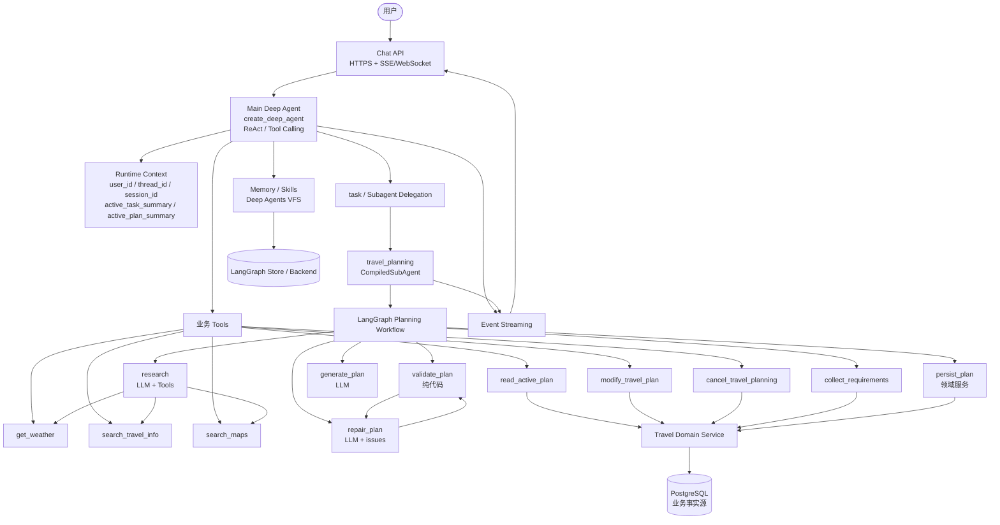
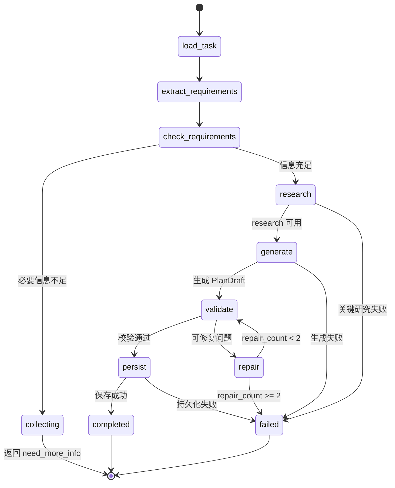
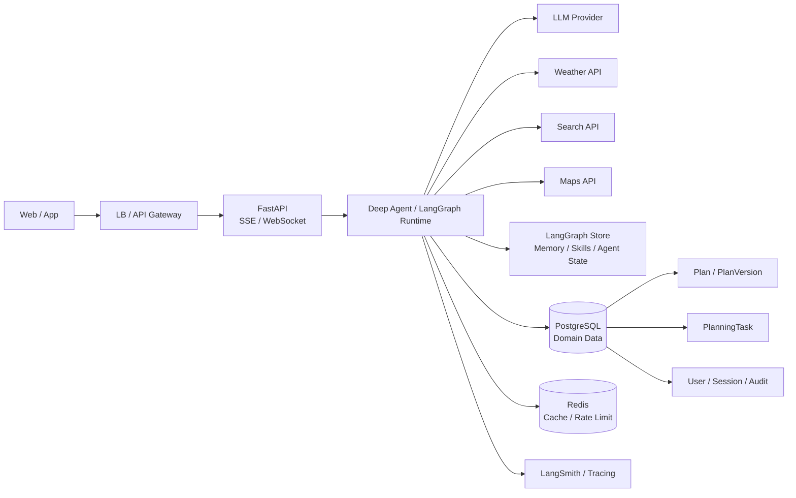

# 智能旅游助手架构文档 v4.1（Deep Agents + LangGraph Workflow 混合架构）

### 版本：4.1
### 日期：2026-08-07
### 状态：MVP 架构基线
### 参考
- LangChain Deep Agents Overview: https://docs.langchain.com/oss/python/deepagents/overview
- Deep Agents Subagents: https://docs.langchain.com/oss/python/deepagents/subagents
- Deep Agents Backends: https://docs.langchain.com/oss/python/deepagents/backends
- Deep Agents Memory: https://docs.langchain.com/oss/python/deepagents/memory
- Deep Agents Skills: https://docs.langchain.com/oss/python/deepagents/skills
- Deep Agents Human-in-the-loop: https://docs.langchain.com/oss/python/deepagents/human-in-the-loop
- Deep Agents Event Streaming: https://docs.langchain.com/oss/python/deepagents/event-streaming

> 本文档是 v4.0 的修订版。v4.1 保留“一个主 Agent + Tools + 专业规划能力”的顶层方向，但将专业旅游规划从普通 Prompt 驱动的 Subagent 升级为 **CompiledSubAgent + LangGraph Workflow**，并将核心业务 Plan/PlanningTask 从 Agent 虚拟文件系统中剥离，交由领域服务和数据库管理。
>
> 核心原则：**模糊决策交给 LLM，确定性流程和业务事实交给代码。**

> **⚠️ 实现修订说明（2026-08-08，以当前代码为准）**
>
> 本文档以下章节为早期设计，与当前 `planning/` 实现存在两处关键偏差，阅读时请以代码和 [设计取舍.md](./设计取舍.md) 为准：
>
> 1. **Plan 不再做多版本化。** 一个 session 只保留一份 `current_plan`（`plans` 表单行 + `plan_json`），修改直接覆盖，不生成新版本、无 `expected_version` / `parent_version` / `plan_versions`。本文档第 5.3 / 5.4 节、§ 6.3 修改工具、以及 `PLAN_VERSION_CONFLICT` 等段落已过时。
> 2. **删除了业务 Validator 与语义 Repair。** 流程收敛为 `extract_requirements → research → generate(Schema Parse → Format Repair x1) → persist`，只做 Schema 解析，不做时间/预算/must_visit 等业务校验，也没有 `repair_plan` / `repair_count` / `ValidationIssue`。本文档中「校验规则」「repair 上限」等章节已过时。

---

## 1. 概述

### 1.1 产品目标

面向 C 端用户的对话式旅游助手，当前核心功能：

1. **通用问答**
   - 旅游常识
   - 天气
   - 地图、距离和路线
   - 景点、住宿、攻略等实时信息

2. **专业旅游行程规划**
   - 多轮收集必要需求
   - 查询天气、地图、攻略等外部信息
   - 生成结构化 Plan（Schema Parse，格式修复一次）
   - 支持中断后继续

3. **计划修改**
   - 用户通过自然语言修改已有 Plan
   - 只修改受影响部分
   - 覆盖保存当前 Plan

### 1.2 当前非目标

MVP 阶段暂不优先实现：

- 机票、酒店直接下单
- 多人协同编辑
- 多模态行程输入
- 自动学习复杂长期画像
- 大规模 Skill 市场
- 多层 Router / Dispatcher 意图系统
- 为了“Agent 化”而把确定性业务规则交给 LLM

### 1.3 为什么使用 Deep Agents

Deep Agents 负责 Agent Harness 层能力，业务系统只实现旅游领域能力。

| 需求 | Deep Agents / LangGraph 提供 | 本项目负责 |
|---|---|---|
| 主 Agent + Tool Calling | `create_deep_agent` | System Prompt、业务工具 |
| 多轮 Agent 推理 | Core tool-calling loop | 工具边界和护栏 |
| 子任务上下文隔离 | Subagents / `task` | 旅游规划能力 |
| 复杂确定性工作流 | `CompiledSubAgent` + LangGraph graph | Planning Workflow |
| 虚拟文件系统 | Backends + filesystem tools | Memory/Skills/研究产物 |
| 长期记忆 | `memory=[...]` | 用户可确认的旅行偏好 |
| Skills | `skills=[...]` | 领域知识包 |
| 流式事件 | Event Streaming / subagent projections | C 端进度 UI |
| HITL | `interrupt_on` + checkpointer | 高风险操作确认 |
| 观测 | LangGraph/LangSmith trace | 业务指标与告警 |

**不采用 Deep Agents 替代业务数据库。**

Deep Agents 的 VFS 是 Agent 上下文和文件访问抽象，不是 Plan、版本、并发控制和事务语义的替代品。

---

## 2. 架构原则

### 2.1 主 Agent 主导自然语言世界

所有用户消息进入一个主 Deep Agent。

主 Agent负责：

- 理解用户意图
- 决定是否调用工具
- 决定调用哪些工具
- 必要时多轮调用工具
- 处理一条消息中的多个意图
- 汇总工具结果
- 生成最终自然语言回复

不增加独立 Router，除非未来真实指标证明需要。

### 2.2 确定性业务流程由代码控制

以下逻辑不能只依赖 Prompt：

- 规划任务状态
- 必填字段判定
- 状态转移
- Plan Schema
- Validator
- 版本号
- optimistic concurrency
- 幂等
- 数据库事务
- 审计字段

### 2.3 Agent 与 Workflow 混合

旅游规划既有探索性，也有确定性。

因此采用：

- **LangGraph Workflow**：控制阶段、状态、重试、分支和持久化
- **LLM/Agent Node**：负责需求抽取、研究、生成、语义修复等模糊任务
- **代码 Node**：负责校验、状态转移、持久化和冲突检查

### 2.4 Plan 是业务事实，不是聊天内容

对话历史只用于语言上下文。

Plan、PlanningTask、PlanVersion 必须有独立事实来源。

### 2.5 VFS 与 Domain Store 分离

VFS 适合：

- `/memories/`
- `/skills/`
- `/research/`
- 大型工具返回的临时 offload
- Agent 工作文件

领域存储适合：

- User
- Session
- PlanningTask
- Plan
- PlanVersion
- AuditLog

### 2.6 多用户隔离由运行时身份决定

Agent Graph 可以共享。

不为每个用户构建一套独立的 Agent 定义。

用户隔离通过：

- authenticated `user_id`
- `thread_id`
- StoreBackend namespace factory
- Domain Repository 的 `user_id` 条件
- 数据库权限/约束

共同保证。

### 2.7 Tool Description 是架构契约

每个 Tool 必须说明：

- 什么时候调用
- 什么时候不要调用
- 参数含义
- 返回 Schema
- 副作用
- 权限
- 失败语义
- 幂等语义

---

## 3. 总体架构



---

## 4. 核心组件

## 4.1 Main Deep Agent

### 职责

- 承接全部用户对话
- 直接回答无需外部信息的普通问题
- 调用实时查询工具
- 将完整行程规划委派给 `travel_planning` CompiledSubAgent
- 修改已有计划时调用 `modify_travel_plan`
- 一条消息存在多个意图时调用多个能力
- 负责最终语言表达

### 不负责

- 不直接操作 Plan 表
- 不自己递增版本号
- 不自行决定 PlanningTask 状态
- 不从聊天历史恢复 Plan 正文
- 不承担规划 Workflow 的阶段推进
- 不把 VFS 文件当业务事务数据库

### 4.1.1 当前 API 形态示例

以下代码用于表达架构形态，具体 Store、checkpointer 和部署配置以项目实际运行环境为准：

```python
from dataclasses import dataclass

from deepagents import create_deep_agent
from deepagents.backends import CompositeBackend, StateBackend, StoreBackend


@dataclass
class TravelRuntimeContext:
    user_id: str
    session_id: str


agent = create_deep_agent(
    # Deep Agents 当前模型字符串使用 provider:model 形式。
    model="anthropic:claude-sonnet-4-6",

    system_prompt=TRAVEL_MAIN_AGENT_PROMPT,

    tools=[
        get_weather,
        search_travel_info,
        search_maps,
        read_active_plan,
        modify_travel_plan,
        cancel_travel_planning,
    ],

    subagents=[
        travel_planning_compiled_subagent,
    ],

    # MVP 可先关闭长期 Memory；启用时使用 VFS 路径。
    memory=["/memories/preferences.md"],

    # MVP 可先不配置；启用后传目录列表。
    skills=["/skills/"],

    # 默认状态文件留在线程 StateBackend；
    # 长期 memory/skills 使用 StoreBackend，并按用户 namespace 隔离。
    backend=CompositeBackend(
        default=StateBackend(),
        routes={
            "/memories/": StoreBackend(
                namespace=lambda rt: (rt.server_info.user.identity,),
            ),
            "/skills/": StoreBackend(
                namespace=lambda rt: (rt.server_info.user.identity,),
            ),
        },
    ),

    # 如果 interrupt_on 被启用，必须配置持久化 checkpointer。
    interrupt_on={
        "cancel_travel_planning": {
            "allowed_decisions": ["approve", "reject"],
        },
    },

    checkpointer=checkpointer,

    context_schema=TravelRuntimeContext,
)
```

### 注意

1. 模型 ID 不应硬编码为旧式 `"claude-sonnet-4"`，应使用当前 LangChain `provider:model` 格式。
2. Deep Agents 当前使用 `memory=[...]` 与 `skills=[...]`。
3. 多用户 StoreBackend 应使用 namespace factory。
4. `interrupt_on` 需要 checkpointer。
5. 生产环境必须使用实际持久化 Store/checkpointer，不能依赖进程内内存实现。

---

## 4.2 Runtime Context / TravelState 注入

Main Agent 每轮都需要知道最少的业务状态，但不应该把完整 Plan 塞进 System Prompt。

推荐注入：

```json
{
  "user_id": "u_xxx",
  "session_id": "sess_xxx",
  "planning_task": {
    "task_id": "task_xxx",
    "state": "collecting"
  },
  "active_plan": {
    "plan_id": "plan_xxx",
    "version": 3,
    "title": "云南5日游",
    "destinations": ["昆明", "大理", "丽江"]
  }
}
```

注入内容只提供：

- 是否有进行中的任务
- 当前任务状态
- 是否有活动计划
- 当前 Plan version
- 极简摘要

完整 Plan 必须通过 `read_active_plan` 获取。

### 推荐实现

优先从认证上下文和领域服务构造 runtime context。

可用 Middleware 做动态注入，但 Middleware 不应成为业务事实来源。

---

## 4.3 travel_planning：CompiledSubAgent

旅游规划不再使用普通 dictionary-based Subagent 承载整个状态流程。

采用：

```python
from deepagents import CompiledSubAgent

travel_planning_compiled_subagent = CompiledSubAgent(
    name="travel-planning",
    description=(
        "创建或继续一次完整旅游行程规划。"
        "用于用户明确要求规划、安排或制定多日旅行计划，"
        "以及继续正在进行的规划任务。"
        "不要用于简单旅游问答或已有计划的局部修改。"
    ),
    runnable=planning_graph,
)
```

官方 Deep Agents 将 `CompiledSubAgent` 用于复杂 Workflow，`runnable` 是已经 compile 的 LangGraph graph。

### 为什么不是普通 Subagent

普通同步 Subagent更适合：

- 独立研究
- 一次性复杂任务
- 上下文隔离
- 最后一次 handoff

完整旅游规划还需要：

- 多轮需求收集
- 显式状态
- 中断恢复
- 失败状态
- 确定性 Validator
- repair 上限
- 业务持久化

因此需要 LangGraph Workflow。

---

## 4.4 Planning Workflow

### 4.4.1 业务状态

对用户/业务层暴露：

```text
collecting
processing
completed
failed
cancelled
```

内部 Workflow 节点：

```text
load_task
extract_requirements
check_requirements
research
generate
validate
repair
persist
finish
```

### 4.4.2 状态图



### 4.4.3 关键思想

`collecting` 不是“让 Subagent 一直活着”。

每次调用 Workflow：

1. 从 PlanningTaskRepository 读取已收集需求。
2. 将本轮用户输入结构化抽取。
3. 合并需求。
4. 信息不足则持久化并退出。
5. 下轮用户回来后重新调用 Workflow，继续读取同一个 PlanningTask。

因此跨会话恢复依赖 **PlanningTask 业务状态**，不是依赖一个长期存活的 Subagent 上下文。

---

## 4.5 Requirements Schema

```json
{
  "origin": "string | null",
  "destinations": ["string"],
  "start_date": "date | null",
  "end_date": "date | null",
  "duration_days": "int | null",
  "traveler_count": "int | null",
  "budget_per_person_cny": "int | null",
  "pace": "relaxed | moderate | intense | null",
  "must_visit": ["string"],
  "exclude": ["string"],
  "notes": "string | null"
}
```

### 进入规划的最低信息

至少需要：

- `destinations`
- `traveler_count`
- `duration_days` 或可计算时长的日期范围

### origin 规则

不能默认成某个“常见城市”。

明确区分两种产品范围：

#### 当地行程模式

如果产品只规划“用户到达目的地后的当地行程”：

- origin 可为空
- Plan 明确写入 assumption：不包含出发城市到目的地的大交通

#### 全程规划模式

如果产品包含：

- 大交通
- 到达时间
- 第一天/最后一天交通
- 全程预算

则 origin 必须收集。

### 可合理默认

- pace = moderate
- 预算未知时可先生成非强预算约束方案，但必须标记 assumption
- 用户未提供偏好时可使用普通成人通用偏好

高影响事实不能随意猜测。

---

## 4.6 Research Node

Research 是探索性任务，适合 LLM + Tools。

可调用：

- `get_weather`
- `search_travel_info`
- `search_maps`

### 输出必须结构化

```json
{
  "weather": [],
  "attractions": [],
  "transport": [],
  "accommodation": [],
  "source_notes": [],
  "assumptions": [],
  "partial_failures": []
}
```

### 失败原则

- 单个非关键来源失败：记录 `partial_failures`，继续
- 关键数据全部失败：Workflow 进入 `failed`
- 不允许在无数据时伪造“已查询”的实时事实

---

## 4.7 Generate Node

输入：

- requirements
- research_result

输出：

- `PlanDraft`

生成节点负责语义规划，不负责最终持久化。

不得自己：

- 创建正式 version
- 写数据库
- 更新 active plan pointer

---

## 4.8 Validator

Validator 是纯代码组件。

### MVP 校验规则

1. schedule 天数与 duration 一致
2. `day` 连续且不重复
3. 每个 `day_id` 唯一
4. 每个 `activity_id` 唯一
5. 每个 `trans_id` 唯一
6. 每个 `acc_id` 唯一
7. must_visit 必须被覆盖
8. exclude 不允许出现
9. 跨城市移动必须存在 transportation
10. 预算存在时检查总预算
11. 每日明显不合理的时间冲突必须报错
12. 所有 required schema 字段存在

### issues Schema

```json
[
  {
    "code": "MISSING_MUST_VISIT",
    "severity": "high",
    "target": "洱海",
    "message": "must_visit 未被安排"
  }
]
```

### Repair

- repair 由 LLM 处理语义修改
- Validator 仍由代码重新执行
- 最大 repair 次数：2
- 超出转 `failed`

---

## 4.9 Travel Domain Service

这是 v4.1 新增的明确边界。

Main Agent、Planning Workflow 和修改工具都不能直接拼 SQL 或随意操作 Plan 文件。

领域层提供：

```text
PlanningTaskService
PlanService
PlanRepository
PlanningTaskRepository
```

### 典型接口

```python
get_or_create_planning_task(...)
update_requirements(...)
mark_task_processing(...)
mark_task_failed(...)
mark_task_cancelled(...)

create_plan(...)
get_active_plan(...)
get_plan_version(...)
modify_plan(...)
list_plan_versions(...)
```

### 领域层负责

- 权限
- user_id 校验
- session_id 校验
- Schema validation
- transaction
- version
- concurrency
- idempotency
- audit

---

## 5. 数据持久化

## 5.1 PostgreSQL 是业务事实源

建议核心实体：

```text
users
sessions
planning_tasks
plans
plan_versions
audit_logs
```

VFS 不是这些实体的唯一事实来源。

---

## 5.2 PlanningTask

```json
{
  "task_id": "task_xxx",
  "user_id": "u_xxx",
  "session_id": "sess_xxx",
  "state": "collecting | processing | completed | failed | cancelled",
  "requirements": {},
  "repair_count": 0,
  "delivered_plan_id": null,
  "last_error_code": null,
  "created_at": "2026-08-07T00:00:00Z",
  "updated_at": "2026-08-07T00:00:00Z"
}
```

### 状态说明

`collecting`
: 等用户补充必要信息。

`processing`
: 系统正在 research / generate / validate / persist。

`completed`
: 已产生正式 Plan。

`failed`
: 当前规划无法完成，可 retry/cancel。

`cancelled`
: 用户取消。

内部 research/generate/validate 节点无需全部暴露成领域状态，但 trace 中必须可观察。

---

## 5.3 Plan 与 PlanVersion

逻辑上：

```text
Plan
  plan_id
  user_id
  session_id
  current_version
  status

PlanVersion
  plan_id
  version
  parent_version
  content_json
  created_at
  created_by
```

### Plan 内容

```json
{
  "plan_id": "plan_abc123",
  "version": 1,
  "parent_version": null,
  "session_id": "sess_xxx",
  "title": "云南5日经典游",
  "requirements": {
    "origin": "上海",
    "destinations": ["昆明", "大理", "丽江"],
    "duration_days": 5,
    "traveler_count": 2,
    "budget_per_person_cny": 5000
  },
  "schedule": [
    {
      "day_id": "d1",
      "day": 1,
      "city": "昆明",
      "activities": [
        {
          "activity_id": "d1_a1",
          "time": "上午",
          "description": "抵达昆明，办理入住"
        }
      ],
      "transportation": [
        {
          "trans_id": "d1_t1",
          "from": "昆明站",
          "to": "市中心",
          "mode": "出租车"
        }
      ],
      "accommodation": {
        "acc_id": "d1_acc",
        "area": "市中心",
        "type": "酒店"
      }
    }
  ],
  "budget_summary": {
    "transportation_cny": 800,
    "accommodation_cny": 1600,
    "food_cny": 900,
    "tickets_cny": 500,
    "other_cny": 500,
    "total_cny": 4300
  },
  "assumptions": [
    "预算不含出发城市到云南的大交通",
    "默认两人一间房"
  ]
}
```

### 核心规则

所有可编辑结构节点都必须有稳定 ID：

- `day_id`
- `activity_id`
- `trans_id`
- `acc_id`

---

## 5.4 版本策略

MVP：

- 每次成功修改产生新完整版本
- 不使用 diff 作为唯一持久化方式
- `parent_version` 指向修改前版本
- 默认从 active version 修改
- 历史版本可读
- 是否支持“恢复某历史版本为新版本”后续单独实现

不要直接覆盖旧版本。

---

## 6. Plan 修改

## 6.1 modify_travel_plan Tool

输入建议：

```json
{
  "plan_id": "plan_abc123",
  "expected_version": 3,
  "instruction": "把丽江住宿换成民宿",
  "client_request_id": "req_xxx"
}
```

### expected_version 必须存在

用于 optimistic concurrency control。

业务层执行：

```text
读取 active version
↓
current_version == expected_version ?
  ├─ no → PLAN_VERSION_CONFLICT
  └─ yes
       ↓
语义定位 target
       ↓
局部修改
       ↓
重算受影响数据
       ↓
Validator
       ↓
事务保存 V4
       ↓
更新 current_version = 4
```

### 冲突

如果两个设备同时从 V3 修改：

```text
request A: V3 -> V4 成功
request B: expected V3，但 current 已 V4
```

B 必须失败：

```json
{
  "code": "PLAN_VERSION_CONFLICT",
  "current_version": 4
}
```

Main Agent 再向用户解释当前计划已更新，并根据需要重新读取 V4。

---

## 6.2 幂等

所有有副作用的业务工具建议接收：

```text
client_request_id
```

数据库建立唯一约束，防止：

- 网络重试
- SSE 重连
- Agent 重复 Tool Call
- 客户端重复提交

造成重复版本。

---

## 7. Deep Agents VFS

## 7.1 VFS 的定位

VFS 用于 Agent 工作上下文。

建议：

```text
/memories/
  preferences.md

/skills/
  budget_optimization/
    SKILL.md

/research/
  ...
```

不要把 `/plans/plan_x_v3.json` 作为生产业务事实源。

如果为了调试或 Agent 读取方便需要导出 Plan 文件，可以把它当缓存/投影，而不是 canonical data。

---

## 7.2 多用户 Memory

Deep Agents 当前支持通过 namespace factory 隔离 StoreBackend。

推荐：

```python
StoreBackend(
    namespace=lambda rt: (
        rt.server_info.user.identity,
    )
)
```

因此所有用户都可以看到逻辑路径：

```text
/memories/preferences.md
```

但底层 namespace 不同。

不要为每个用户生成文件名：

```text
AGENTS_user_123.md
```

作为主要隔离机制。

隔离应该由 authenticated identity + namespace 完成。

---

## 7.3 Memory 与项目 AGENTS.md 不同

必须避免两个概念混淆：

### 仓库根目录 `/AGENTS.md`

用于开发 Agent 的项目工程规则。

### C 端用户 Memory

建议：

```text
/memories/preferences.md
```

用于单个旅游用户长期偏好。

两者禁止混用。

---

## 7.4 Skills

当前 Deep Agents API 使用：

```python
skills=["/skills/"]
```

而不是 `skills_dir=`。

MVP 可以关闭 Skills。

未来适合加入：

```text
/skills/
  budget_optimization/
    SKILL.md

  festival_travel/
    SKILL.md

  family_with_kids/
    SKILL.md
```

Skill 只承载：

- 可复用领域流程
- 专业知识
- 策略
- 模板

不要用 Skill 保存单个用户业务状态。

---

## 8. Human-in-the-loop

HITL 只用于真实需要用户审批的操作。

候选：

- 删除历史 Plan
- 覆盖重要用户数据
- 将来执行付费预订
- 不可逆操作

### cancel 是否需要 HITL

MVP 可以有两种设计：

A. 用户明确说“取消规划”后直接取消；
B. 如果取消会丢失大量已填需求，再触发确认。

不建议所有取消都机械弹确认。

### Deep Agents 要求

使用 `interrupt_on` 时必须配置 checkpointer，并且恢复时必须沿用同一个 thread。

---

## 9. Streaming

当前优先采用 Deep Agents Event Streaming。

核心形态：

```python
stream = agent.stream_events(input, version="v3")

for message in stream.messages:
    ...

for subagent in stream.subagents:
    for message in subagent.messages:
        ...
    for call in subagent.tool_calls:
        ...
```

前端不直接展示内部 Tool 名。

应映射为产品事件：

```text
planning.started
planning.researching
planning.generating
planning.validating
planning.completed
planning.failed
```

示例：

```text
正在查询目的地天气…
正在整理景点和交通信息…
正在生成每日路线…
正在检查时间和预算…
行程已生成。
```

### 原则

流式进度必须来自真实节点或 Tool 事件。

禁止生成假的“正在查询”动画，而实际没有执行相应操作。

---

## 10. 核心工作流

## 10.1 通用问答

```text
用户：
“丽江 10 月冷吗？”

Main Agent
↓
判断需要实时信息
↓
get_weather
↓
拿到结果
↓
自然语言回复
```

---

## 10.2 首次规划：信息一次足够

```text
用户：
“帮我规划云南 5 日游，2 个人，10 月 1 日出发，从上海走。”

Main Agent
↓
task → travel-planning CompiledSubAgent
↓
Planning Workflow

load/create PlanningTask
↓
extract requirements
↓
check requirements = sufficient
↓
research
↓
generate PlanDraft
↓
validate
↓
persist Plan V1
↓
task completed

Main Agent
↓
读取摘要
↓
回复用户
```

---

## 10.3 首次规划：信息不足

```text
用户：
“帮我规划云南旅游。”

Main Agent
↓
travel-planning
↓
extract
↓
destinations = 云南
duration = missing
traveler_count = missing
↓
PlanningTask 保存 state=collecting
↓
return need_more_info
↓
Main Agent 询问最少必要信息
```

下一轮：

```text
用户：
“5 天，两个人。”

Main Agent
↓
travel-planning
↓
读取原 PlanningTask
↓
合并新 requirements
↓
继续 Workflow
```

Main Agent 不需要从聊天历史重新猜需求。

---

## 10.4 修改计划

```text
用户：
“把丽江住宿换成民宿。”

Runtime Context:
active_plan = plan_abc v3

Main Agent
↓
modify_travel_plan(
    plan_id=plan_abc,
    expected_version=3,
    instruction=...
)
↓
PlanService
↓
读取 V3
↓
LLM 解析 target = d3_acc
↓
局部修改
↓
重算预算/路线影响
↓
Validator
↓
事务创建 V4
↓
更新 active version
↓
返回 change summary
↓
Main Agent 回复
```

---

## 10.5 混合意图

```text
用户：
“丽江 10 月冷吗？另外我们改成 3 个人。”

当前 PlanningTask = collecting

Main Agent
↓
可调用：
1. get_weather
2. travel-planning（更新 requirements）

↓
拿到两个结果
↓
生成一个自然回复
```

不用 Router + Dispatcher + Merger。

---

## 11. 主 Agent System Prompt 骨架

```text
你是面向 C 端用户的专业旅游助手。

你的职责：
1. 回答普通旅游问题。
2. 在需要实时数据时调用合适的查询工具。
3. 在用户要求创建或继续完整多日行程时，委派给 travel-planning。
4. 在用户修改已有计划时调用 modify_travel_plan。
5. 一条消息包含多个目标时，可以调用多个能力并整合回答。

# 旅游规划

当用户明确要求“规划、安排、制定行程”，或者 Runtime Context 显示存在 collecting 状态的规划任务且用户正在补充需求时，使用 travel-planning。

不要自己维护 PlanningTask 状态。
不要通过聊天历史自行重建完整 Requirements。
不要自己写正式 Plan。

# 修改已有计划

当 Runtime Context 中存在 active_plan 且用户要求修改、替换、删除、增加某个行程内容时，使用 modify_travel_plan。

传入 Runtime Context 中提供的 plan_id 和 version。
不要从聊天历史寻找计划正文。

# 普通问答

无需实时数据的常识问题可直接回答。

涉及天气、实时路线、位置、景点开放信息等需要外部事实时，调用对应工具。

# 工具结果

工具失败时，不要伪造成功结果。
如果数据不足，明确说明限制。
如果工具返回版本冲突，先读取最新计划再向用户解释。

# 回复

保持自然、简洁。
不向普通用户暴露内部 Tool 名、数据库字段、task_id 或 plan_id。
Plan 内容可以格式化展示，但不要把内部执行链暴露给用户。
```

---

## 12. 并发设计

### 12.1 不假设“同 thread 永远天然串行”

运行层必须明确并发策略。

业务层依然必须承担数据一致性。

即使 Agent Runtime 对 thread 做排队，也不能替代：

- Plan optimistic locking
- unique idempotency key
- DB transaction

### 12.2 Plan 并发

使用：

```text
plan_id + expected_version
```

做 compare-and-swap。

### 12.3 PlanningTask 并发

推荐：

- PlanningTask 表有 `updated_at` 或 revision
- update 时使用 optimistic concurrency
- 同 task 不允许两个 processing run 同时成功推进
- 必要时数据库 advisory lock / row lock，而不是依赖 Agent Prompt

---

## 13. 错误处理

| 场景 | 行为 |
|---|---|
| 单个查询 Tool 超时 | Agent 可重试或降级 |
| research 部分来源失败 | 记录 partial failure，能继续则继续 |
| research 关键数据全部失败 | PlanningTask → failed |
| generate 失败 | failed，可 retry |
| Validator 可修复 | repair，最多 2 次 |
| Validator 超过修复上限 | failed + issues |
| Plan version 冲突 | 返回 `PLAN_VERSION_CONFLICT` |
| 重复 request_id | 返回此前结果，不重复执行 |
| DB 写失败 | 不更新 active version |
| HITL 中断 | 保持 checkpoint，等待用户 decision |

---

## 14. 安全与权限

### 14.1 用户隔离

所有 Domain Repository 查询必须带真实认证得到的 `user_id`。

不能信任 LLM 生成的 user_id。

### 14.2 Tool 参数

以下参数由运行时注入或代码补全，不应完全依赖 LLM：

- user_id
- session_id
- authenticated tenant
- permission scope

### 14.3 Prompt Injection

外部搜索结果都视为不可信数据。

不得允许网页文本：

- 修改 System Prompt
- 获取其它用户 Plan
- 改写权限
- 发起未经授权的 Tool

---

## 15. 可观测性

每次请求至少记录：

```text
request_id
user_id
session_id
thread_id
model
tool_calls
subagent_calls
planning_task_id
planning_state_before
planning_state_after
plan_id
plan_version_before
plan_version_after
latency_ms
input_tokens
output_tokens
tool_errors
fallback_reason
```

### 关键产品指标

- 规划启动率
- 规划完成率
- 平均追问轮数
- 用户主动取消率
- Validator 首次通过率
- repair 次数
- Tool failure rate
- Plan 修改成功率
- version conflict rate
- Main Agent 错误工具选择率
- 混合意图漏处理率

---

## 16. 测试策略

## 16.1 Unit Tests

必须覆盖：

### Validator
- 天数
- stable IDs
- must_visit
- exclude
- budget
- transportation
- schema

### Repository
- create Plan V1
- create V2
- version conflict
- transaction rollback
- idempotency

### Planning Workflow
- collecting
- requirements merge
- successful planning
- research failure
- generate failure
- repair once
- repair > 2
- persist failure

---

## 16.2 Golden Conversation Tests

至少 30-50 条。

覆盖：

1. 普通常识 QA
2. 天气查询
3. 地图查询
4. 完整规划信息一次给全
5. 缺日期
6. 缺人数
7. 当地行程无需 origin
8. 全程规划必须 origin
9. 多轮补充需求
10. 规划过程中普通 QA
11. 混合意图
12. 修改住宿
13. 修改景点
14. 删除活动
15. 修改预算
16. 版本冲突
17. 用户取消
18. Tool timeout
19. research partial failure
20. Validator repair
21. retry
22. Prompt injection in search result

### Golden Test 核心检查

不仅检查最终文本。

还检查：

- 是否调用正确 Tool
- 是否错误调用规划
- 是否遗漏工具
- 业务状态是否正确
- 数据库版本是否正确
- 是否产生重复副作用

---

## 17. 部署视图



### 存储职责

| 数据 | 事实源 | 说明 |
|---|---|---|
| User / Session | PostgreSQL | 业务数据 |
| PlanningTask | PostgreSQL | 跨轮规划状态 |
| Plan / PlanVersion | PostgreSQL | 核心事实源 |
| User Memory | LangGraph Store + StoreBackend | 用户长期偏好 |
| Skills | Backend / 部署资源 | 领域知识 |
| Thread Checkpoint | LangGraph Checkpointer | 对话/执行恢复 |
| Cache / Rate Limit | Redis | 非核心事实 |
| 大附件 | 对象存储 | 如果未来需要 |

---

## 18. Memory 策略

MVP 默认：

**关闭长期自动偏好学习。**

原因：

- 先验证核心规划闭环
- 防止错误偏好长期污染
- 降低隐私复杂度

后续打开时：

只保存：

- 用户明确声明的长期偏好
- 可解释、可删除的数据

例如：

```markdown
# Travel Preferences

- 旅行节奏：轻松
- 住宿：偏好市中心
- 饮食：不吃海鲜
```

不要自动写入：

- 一次旅行的临时预算
- 临时同行人数
- 单次目的地
- 敏感信息

Memory 应提供用户可查看、修改、删除能力。

---

## 19. Skills 策略

MVP：

**不依赖 Skills 才能完成核心流程。**

Skills 是增强层。

未来可增加：

- 节假日规划策略
- 亲子旅行
- 老年旅行
- 徒步旅行
- 预算优化
- 自驾规划

业务硬规则仍不能只写在 Skill 中。

---

## 20. v4.0 → v4.1 关键变化

| 维度 | v4.0 | v4.1 |
|---|---|---|
| 顶层 | Main Agent + Tools | 保持 |
| 专业规划 | 普通 Subagent + Prompt 流程 | **CompiledSubAgent + LangGraph Workflow** |
| 状态推进 | Subagent Prompt | **代码 Graph** |
| Research | Subagent | Workflow 中的 Agentic Node |
| Generate | Subagent | Workflow 中的 LLM Node |
| Validate | Tool | 保持纯代码 |
| Plan 持久化 | VFS `/plans/**` | **Domain Service + PostgreSQL** |
| PlanningTask | VFS `/tasks/**` | **PostgreSQL 业务状态** |
| VFS | 业务数据 + Memory | **只做 Agent 上下文/Memory/Skills** |
| 多用户隔离 | 每用户 Agent + filename/namespace | **共享 Agent Graph + runtime identity + namespace factory** |
| Memory API | `memory="AGENTS_x.md"` | **`memory=["/memories/preferences.md"]`** |
| Skills API | `skills_dir=` | **`skills=[...]`** |
| StoreBackend | 固定字符串 namespace | **runtime namespace factory** |
| CompositeBackend | routes list | **default + routes dict** |
| HITL | `interrupt_on` | **明确需要 checkpointer** |
| 修改并发 | 未定义 | **expected_version + optimistic lock** |
| 幂等 | 未定义 | **client_request_id** |
| origin | 可随意默认 | **按产品 scope 明确 required/optional** |

---

## 21. 实施顺序

### Phase 1：对话骨架

实现：

- Main Deep Agent
- runtime context
- get_weather
- search_travel_info
- search_maps
- 基础 SSE

目标：

普通 QA 和 Tool Calling 跑通。

---

### Phase 2：Planning Domain

实现：

- Requirements Schema
- PlanningTask
- Plan / PlanVersion
- Repository
- Validator

先不做复杂 Agent。

目标：

业务数据模型和硬约束稳定。

---

### Phase 3：Planning Workflow

实现：

```text
collect
research
generate
validate
repair
persist
```

封装成 LangGraph graph，再通过 `CompiledSubAgent` 接入 Main Agent。

目标：

首次规划完整闭环。

---

### Phase 4：Plan Modification

实现：

- read_active_plan
- modify_travel_plan
- stable ID 定位
- expected_version
- transaction
- idempotency

目标：

从 V1 → V2 → V3 正确工作。

---

### Phase 5：生产护栏

实现：

- retry / timeout
- tracing
- Golden tests
- rate limits
- HITL（真正需要的操作）
- persistent store/checkpointer
- 安全和数据隔离测试

---

### Phase 6：增强能力

根据真实需求再启用：

- Memory
- Skills
- MCP
- Async Subagents
- 更复杂推荐

---

## 22. 架构决策摘要

### ADR-001：不使用前置 Router

**状态：Accepted**

原因：

当前核心意图空间小，Main Agent tool-calling 足够；Router 会重复消耗上下文并增加 Dispatcher/Merger 复杂度。

未来只有在意图数量、团队边界、合规或成本指标明确要求时再引入。

---

### ADR-002：Main Agent 使用标准 Tool-Calling / ReAct 能力

**状态：Accepted**

不把 Main Agent 强制限制成单轮 Tool Call。

Agent 可以根据 Tool 结果继续查询。

安全依赖超时、token budget、重复调用检测等护栏，不依赖人为削弱推理能力。

---

### ADR-003：旅游规划采用 Hybrid Workflow

**状态：Accepted**

使用 LangGraph 负责确定性阶段，用 Agent/LLM 节点负责模糊任务，再作为 `CompiledSubAgent` 挂到 Main Deep Agent。

---

### ADR-004：Plan 不以 VFS 为业务事实源

**状态：Accepted**

核心 Plan 和 PlanningTask 使用 Domain Service + PostgreSQL。

Deep Agents VFS 用于 Agent 上下文、Memory、Skills 和临时文件。

---

### ADR-005：多用户共享 Agent 定义

**状态：Accepted**

不按用户构建不同 Agent Graph。

通过 authenticated runtime identity、namespace factory 和业务数据库 user_id 条件隔离。

---

### ADR-006：Plan 修改必须乐观锁

**状态：Accepted**

使用 `expected_version` 防止跨设备或重复请求产生并发覆盖。

---

## 23. 后续 LLM / 开发 Agent 工作规则

接手本项目时：

1. 不要根据聊天历史修改架构，先读取当前项目文档和代码。
2. Deep Agents API 必须以当前官方文档和实际安装版本为准。
3. 不要重新把 Plan 放回聊天历史或 VFS 作为唯一事实源。
4. 不要把 Planning Workflow 全部退化为一个巨大 Prompt。
5. 不要因为使用 Agent 就删除 Validator、Repository、事务或版本控制。
6. 新增 Tool 前先检查现有能力是否已经覆盖。
7. 修改 Plan Schema 后必须同步更新 Validator、Repository 和 Golden tests。
8. 修改 Tool Description / System Prompt 后必须运行 Golden Conversation Tests。
9. 只有真实指标证明需要时才引入 Router。
10. 无法从代码确认的业务规则必须标记“待确认”，不能自行编造。

---

## 24. 一句话总结

> **v4.1 = 一个 Main Deep Agent 负责自然语言决策 + 一个 CompiledSubAgent 承载旅游规划 LangGraph Workflow + 领域 Service/Repository 保证业务状态、版本、事务和并发正确性。**

主 Agent 负责“理解和选择”。

Workflow 负责“按正确顺序完成规划”。

LLM Node 负责“需要智能的部分”。

代码和数据库负责“绝不能靠猜的部分”。

这是当前 MVP 的架构基线。

