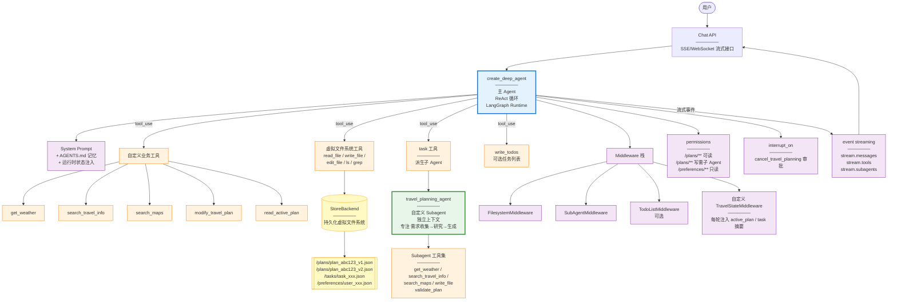
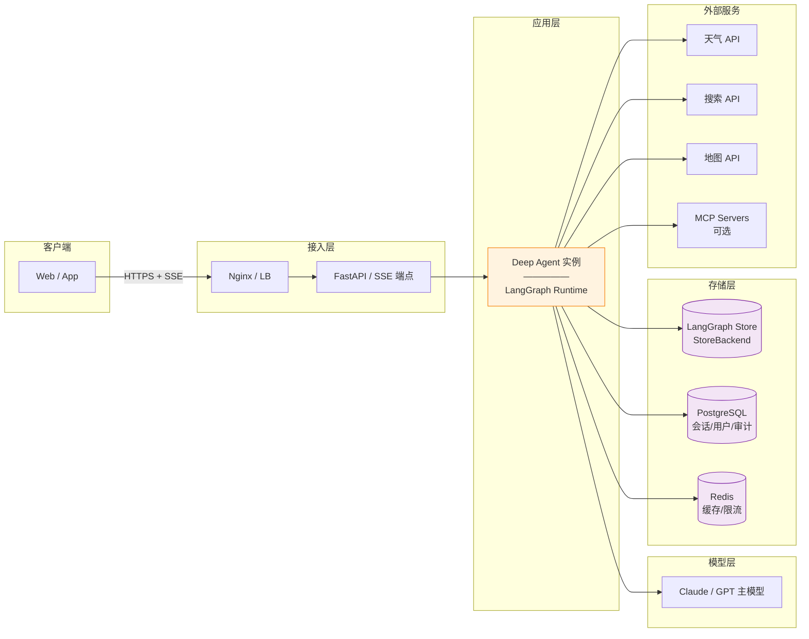

# 智能旅游助手架构文档 v4.0（Deep Agents 框架版）

### 版本: 4.0
### 日期: 2026-08-06
### 参考: [LangChain Deep Agents](https://docs.langchain.com/oss/python/deepagents/overview)

---

## 1. 概述

### 1.1 项目目标

面向 C 端的对话式旅游助手，核心功能：

- **通用旅游问答**：天气、路线、攻略、常识
- **旅游行程规划**：多轮收集需求 → 研究 → 生成结构化计划
- **计划修改与版本管理**：对已生成的计划进行局部修改

### 1.2 为什么选择 Deep Agents 框架

Deep Agents 是构建在 LangGraph 之上的 Agent Harness（"外壳"），提供了主 Agent 循环 + 虚拟文件系统 + 子 Agent + 技能 + 记忆 + 中间件等开箱即用的能力，特别适合 Claude Code 风格的"主 Agent + 工具 + 子 Agent"架构。

| 需求 | Deep Agents 提供 |
|---|---|
| 主 Agent + ReAct 循环 | `create_deep_agent` 开箱即用 |
| 复杂子任务隔离上下文 | 内置 `task` 工具 + 自定义 Subagent |
| 计划的持久化与版本管理 | 虚拟文件系统 + StoreBackend |
| 长期用户偏好 | Memory (AGENTS.md) |
| 领域知识按需加载 | Skills (progressive disclosure) |
| 长对话上下文控制 | 内置 summarization 与 offloading |
| 敏感操作（如取消计划）审批 | `interrupt_on` HIL 机制 |
| 流式回复 & 进度事件 | `stream.subagents` typed streams |
| 持久化执行、断点续跑 | LangGraph runtime |

**核心哲学**：不重新造轮子，把业务逻辑聚焦在 Prompt、Tool、Subagent 契约上。

---

## 2. 架构原则

1. **主 Agent 主导**：所有用户对话由一个 `create_deep_agent` 实例承接，通过 ReAct + Tool-calling 驱动。
2. **确定性子流程封装为 Subagent 或 Tool**：旅游规划的研究/生成阶段封装为一个 **`travel_planning_agent` 子 Agent**，享受独立上下文窗口。
3. **状态即文件**：所有需要持久化的状态（规划任务、计划版本、用户偏好）都写入虚拟文件系统，backend 为 **StoreBackend**（跨会话持久化）。
4. **让 LLM 自主决策，代码兜底约束**：不做 Router 前置分类，靠主 Agent 的 tool-calling 自然选择工具；用 middleware/permissions 提供护栏。
5. **Prompt 即架构**：主 Agent 的 System Prompt 是核心业务规则的载体。

---

## 3. 系统架构图



---

## 4. 核心组件详解

### 4.1 主 Agent（`create_deep_agent` 实例）

**代码骨架**：

```python
from deepagents import create_deep_agent
from deepagents.backends import StoreBackend

agent = create_deep_agent(
    model="claude-sonnet-4",
    system_prompt=TRAVEL_AGENT_SYSTEM_PROMPT,
    tools=[
        get_weather,
        search_travel_info,
        search_maps,
        modify_travel_plan,
        read_active_plan,
    ],
    subagents=[travel_planning_subagent_config],
    memory=f"./memory/AGENTS_{user_id}.md",  # 用户偏好（按用户隔离）
    skills_dir="./skills/",           # 领域技能包
    backend=StoreBackend(namespace=f"user_{user_id}"),  # 按用户隔离命名空间
    permissions=[
        {"operations": ["read"], "paths": ["/plans/**"], "mode": "allow"},
        {"operations": ["write"], "paths": ["/plans/**"], "mode": "deny"},  # 主Agent不直接写计划
        {"operations": ["read", "write"], "paths": ["/tasks/**"], "mode": "allow"},
    ],
    interrupt_on={
        "cancel_travel_planning": True,   # 取消操作需用户确认
    },
    middleware=[
        TravelStateMiddleware(),          # 自定义：注入当前 active_plan / task 摘要
    ],
)
```

**职责**：

- 承接所有用户消息
- 通过 ReAct 循环决策调用哪些工具
- 对通用问答直接生成回答
- 对规划请求委派给 `travel_planning_agent` 子 Agent
- 对修改请求调用 `modify_travel_plan` 工具

**不做**：

- 不做意图前置分类（靠 tool-calling 自然完成）
- 不直接写计划文件（受 permissions 限制，只能通过子 Agent 或 modify_travel_plan 工具）
- 不做多步骤规划的阶段推进（交给子 Agent）

---

### 4.2 travel_planning_agent（自定义 Subagent）

**为什么用 Subagent 而不是普通 Tool**：

- 规划任务涉及**大量工具调用**（并行查天气、搜攻略、查地图）——中间产物会污染主对话上下文
- Subagent 提供**独立上下文窗口**，只把最终结果压缩返回
- 天然支持流式进度回传（`stream.subagents`）

**Subagent 配置**：

```python
travel_planning_subagent_config = {
    "name": "travel_planning_agent",
    "description": (
        "规划一次完整的旅行行程。当用户明确表达'规划/安排/制定行程'意图，"
        "或需要基于已收集需求生成计划时使用。"
        "输入应包含用户完整的规划需求（目的地、时间、人数、预算等，缺失字段可留空）。"
        "输出：可能是'需要更多信息'（附追问）或'已生成计划'（附 plan_id）。"
    ),
    "system_prompt": TRAVEL_PLANNING_PROMPT,
    "tools": [
        get_weather,
        search_travel_info,
        search_maps,
        validate_plan,      # 校验器：规则代码
        "write_file",       # 允许写 /plans/**
        "read_file",
    ],
    "permissions": [
        {"operations": ["write"], "paths": ["/plans/**"], "mode": "allow"},
    ],
}
```

**内部流程（写在 subagent 的 system_prompt 里）**：

```
1. 需求分析：解析输入中的目的地、时间、人数、预算、偏好
2. 缺失判断：
   - 目的地 + 时长/日期 + 人数缺任一 → 返回 need_more_info + questions
   - 齐全 → 进入研究
3. 并行研究：调用 get_weather / search_travel_info / search_maps 收集信息
4. 生成计划：产出结构化 JSON（包含 day_id/activity_id/acc_id 等稳定 ID）
5. 校验：调用 validate_plan 工具
   - 通过 → 写入 /plans/plan_{id}_v1.json，返回摘要 + plan_id
   - 未通过（≤2次）→ 局部修复后重校
   - 未通过（>2次）→ 返回 error + issues 清单
```

**为什么校验器是代码工具而不是让 Subagent LLM 判断**：

- 校验规则是硬约束（总天数、预算、必去点）
- 代码校验比 LLM 反复"思考是否合规"更快、更可靠、更便宜

---

### 4.3 虚拟文件系统（状态持久化）

Deep Agents 内置的**虚拟文件系统**让"计划版本管理""任务状态""用户偏好"这些数据自然地以文件形式存储，主 Agent 和 Subagent 都能通过 `read_file`/`write_file`/`ls` 访问。

**目录结构**：

```
/tasks/
  task_xxx.json           # 当前规划任务状态（state, requirements, ...）
/plans/
  plan_abc123_v1.json     # 计划 V1（Subagent 写入）
  plan_abc123_v2.json     # 计划 V2（modify_travel_plan 写入）
  plan_abc123_index.json  # 当前活动版本指针
/preferences/
  user_xxx.json           # 长期偏好（预算等级、节奏、饮食）
```

**Backend 选择**：

- **MVP**：`StoreBackend`（LangGraph Store，跨会话持久化，简单可用）
- **生产**：`CompositeBackend` 路由 —— 计划走关系型 DB，任务状态走 Store，缓存走 Redis

**Permission 规则的作用**：

- 主 Agent 只能读 `/plans/**`，不能直接写 —— **强制规划走 Subagent、修改走 modify 工具**
- `/preferences/**` 只读 —— 防止 Agent 未经确认改用户偏好
- `/tasks/**` 主 Agent 可读写 —— 维护任务生命周期

这就是 Deep Agents 的一个精妙之处：**用 permissions 把架构约束固化，而不是靠 Prompt 提醒**。

---

#### 4.3.1 多用户数据隔离（面向 C 端的关键设计）

虚拟文件系统本身是一个**抽象层**，它不存储数据，也不天然区分用户。**是否多用户共用、如何隔离，完全取决于你如何配置后端（Backend）和命名空间（namespace）**。

**推荐做法：按用户分配独立 `namespace`**

为每个用户（或用户会话）动态设置 `namespace`，让每个用户的 Agent 实例操作各自独立的文件系统命名空间，实现**天然的数据隔离**：

```python
# 按用户 ID 隔离（推荐）
backend = StoreBackend(namespace=f"user_{user_id}")

# 或按会话 ID 隔离（每个会话独立）
backend = StoreBackend(namespace=f"session_{session_id}")
```

**隔离策略对比**：

| 策略 | 实现方式 | 优点 | 缺点 |
|---|---|---|---|
| **按用户 namespace**（推荐） | `namespace=f"user_{user_id}"` | 隔离最彻底，无需在路径里拼用户 ID，权限配置简单 | 每个用户一个命名空间，需管理命名空间生命周期 |
| **按会话 namespace** | `namespace=f"session_{session_id}"` | 会话级隔离，天然支持"一个用户多个会话" | 同一用户跨会话数据（如偏好）无法共享 |
| **共享 namespace + 路径隔离** | `namespace="travel"`，路径强制 `/users/{user_id}/...` | 单一命名空间便于统一管理 | 依赖 Agent 严格按路径规则操作，隔离靠约定，鲁棒性差 |

**结论**：面向多用户 C 端应用，**优先采用"按用户 namespace"**。它把隔离从"依赖 Agent 遵守路径约定"提升为"框架层面的硬隔离"，最鲁棒、最安全。

---

#### 4.3.2 数据最终存储在哪里（持久化）

虚拟文件系统是抽象层，**数据最终存储在它所配置的后端（Backend）中**。后端决定了数据是落在内存、数据库还是对象存储。

**`StoreBackend` 的存储位置**：

`StoreBackend` 基于 LangGraph 的 Graph State 存储机制，其物理存储位置取决于 LangGraph 配置的持久化后端：

| LangGraph 后端 | 数据位置 | 适用场景 |
|---|---|---|
| **内存 (Memory)** | 服务器内存 | 仅开发/测试，重启即丢，**不适用于生产** |
| **PostgreSQL / MySQL** | 关系型数据库 | 生产首选，持久、可靠、可查询 |
| **Redis** | 内存数据库 | 高并发、低延迟的临时状态 |
| **对象存储 (S3/GCS)** | 云对象存储 | 大文件、Blob、附件 |

> **重要**：`StoreBackend` 默认可能使用内存后端。**生产环境必须显式配置为持久化数据库后端（如 PostgreSQL）**，否则数据只存在于服务器内存中，服务重启即丢失。

**`CompositeBackend` 的存储位置（生产推荐）**：

`CompositeBackend` 允许按文件路径规则，将不同类型的数据路由到不同的物理存储：

```python
from deepagents.backends import CompositeBackend, StoreBackend, ObjectStoreBackend

backend = CompositeBackend(
    routes=[
        # 计划 JSON → PostgreSQL（JSONB 字段）
        {"match": "/plans/**", "backend": StoreBackend(namespace="plans", store=pg_store)},
        # 任务状态 → Redis（高并发低延迟）
        {"match": "/tasks/**", "backend": StoreBackend(namespace="tasks", store=redis_store)},
        # 用户偏好 → PostgreSQL
        {"match": "/preferences/**", "backend": StoreBackend(namespace="prefs", store=pg_store)},
        # 未来大文件 → 对象存储
        {"match": "/attachments/**", "backend": ObjectStoreBackend(bucket="travel-attachments")},
    ]
)
```

**总结**：

- 虚拟文件系统的数据**不会只存在于服务器内存**（除非你明确选择内存后端且仅用于开发测试）。
- 生产环境配置**持久化后端**（PostgreSQL / Redis / 对象存储），数据存储在这些**外部存储服务**中，保证持久性、可靠性和可扩展性。
- 多用户隔离通过 **namespace** 实现，持久化通过 **Backend** 实现，两者正交、互不冲突。

---

### 4.4 业务工具集

| 工具名 | 类型 | 说明 |
|---|---|---|
| `get_weather` | 只读 API | 查询目的地天气 |
| `search_travel_info` | 只读 API | 搜索景点/攻略/住宿 |
| `search_maps` | 只读 API | 查询距离/路线/交通 |
| `read_active_plan` | 内部 | 读 `/plans/plan_{id}_index.json` → 加载当前版本 |
| `modify_travel_plan` | 内部 + LLM | 加载 V_n → 局部修改 → 校验 → 保存 V_{n+1} |
| `validate_plan` | 纯代码 | 硬规则校验（Subagent 内部使用） |
| `cancel_travel_planning` | 内部 | 标记 task 为 cancelled（`interrupt_on` 要求用户确认） |

`modify_travel_plan` 是一个"半 LLM 工具"：内部调用一次 LLM 做局部修改，但流程是确定的（读→改→校验→写），所以不用 Subagent，用普通工具即可。

---

### 4.5 Memory：用户长期偏好

Deep Agents 的 `memory` 参数接受一个 `AGENTS.md` 文件路径，在**每次 Agent 启动时自动加载**（作为系统 Prompt 的一部分）。

**示例 AGENTS.md**：

```markdown
# 用户旅行偏好
- 预算等级：中等（每人每日 800-1200 元）
- 旅行节奏：适中，不喜欢过于紧凑
- 住宿偏好：干净、市中心、有独立卫浴
- 饮食：不吃辣、不吃海鲜
- 交通偏好：优先高铁，其次飞机
```

**特点**：

- 主 Agent 无需每次询问偏好
- Agent 可以基于交互**主动更新** AGENTS.md（比如用户说"以后别推荐辣的了"）
- 偏好会**跨会话保留**

**MVP 阶段**：可以先不启用 memory 参数，简化实现；后续用户量起来再打开。

---

### 4.6 Skills：领域技能包（可选）

Skills 是 Deep Agents 的**进阶特性**：把领域知识按需加载，避免系统 Prompt 膨胀。每个 Skill 是一个目录 + `SKILL.md`。

**未来可加的技能**：

```
skills/
  budget_optimization/
    SKILL.md              # 触发条件："用户对预算敏感 / 请求省钱建议"
    strategies.md         # 详细省钱策略
  festival_travel/
    SKILL.md              # 触发条件："出行时间是国庆/春节等节假日"
    crowd_avoidance.md    # 避峰技巧
  family_with_kids/
    SKILL.md              # 触发条件："出行人员包含儿童"
    kid_friendly_places.md
```

**Progressive disclosure**：Agent 启动只读每个 `SKILL.md` 的 frontmatter；具体任务需要时才加载完整内容。

**MVP 不做**：先把主流程跑通。

---

### 4.7 Middleware：自定义 TravelStateMiddleware

Deep Agents 支持在主 Agent 每轮调用前**注入运行时状态**（类似 Claude Code 的 `<system-reminder>`）。

**功能**：每轮从虚拟文件系统读取当前状态，注入到 System Prompt：

```python
class TravelStateMiddleware:
    def before_model_call(self, state):
        session_id = state["session_id"]
        active_task = fs.read_file(f"/tasks/{session_id}_task.json")
        active_plan_index = fs.read_file(f"/plans/{session_id}_index.json")

        reminder = f"""
        <system-reminder>
        当前会话状态：
        - 进行中的规划任务: {active_task.state if active_task else "无"}
        - 活动计划: {active_plan_index.plan_id if active_plan_index else "无"} (v{active_plan_index.version})
        - 计划摘要: {active_plan_index.summary if active_plan_index else "无"}
        </system-reminder>
        """
        state["messages"].insert(-1, SystemMessage(content=reminder))
        return state
```

**作用**：主 Agent 每轮都能感知"当前有没有规划任务/有没有活动计划"，无需从对话历史推断，也无需自己调 `read_file` 探测。

---

### 4.8 Human-in-the-loop：`interrupt_on`

对敏感/破坏性操作要求用户确认：

```python
interrupt_on={
    "cancel_travel_planning": True,  # 取消进行中的规划前弹审批
}
```

**用户体验**：

- 用户说"算了不规划了"
- 主 Agent 决定调 `cancel_travel_planning`
- LangGraph 中断执行，前端弹出"确认取消当前规划任务？已收集的需求将丢失"
- 用户点确认 → 继续执行；点取消 → 主 Agent 收到"用户否决"并调整

**MVP 阶段**：可选，也可以先靠 Prompt 让主 Agent 自己二次确认。

---

### 4.9 Streaming：流式事件

Deep Agents 的 `stream.subagents` 支持**每个子 Agent 独立的流**，非常适合 C 端体验：

**前端能看到的事件**：

- `stream.messages`：主 Agent 的 token 流
- `stream.tools`：主 Agent 调用了哪些工具
- `stream.subagents.travel_planning_agent.messages`：Subagent 生成的 token
- `stream.subagents.travel_planning_agent.tools`：Subagent 调用了哪些工具（"正在查询丽江天气..."、"正在搜索大理住宿..."）

**用户看到的实际体验**：

```
[进度] 正在查询目的地天气...
[进度] 正在搜索景点攻略...
[进度] 正在规划每日路线...
[进度] 正在校验时间与预算...
已为您生成 5 日云南行程计划，请查看！
```

---

## 5. 关键工作流

### 5.1 通用问答

```
用户: "丽江 10 月冷吗？"
  ↓
主 Agent 收到消息 (TravelStateMiddleware 注入: 无任务、无计划)
  ↓
主 Agent 决策: 调用 get_weather(丽江, 10月)
  ↓
获得工具结果 → 生成回复
  ↓
用户看到: "丽江 10 月平均 10-20℃，早晚较凉..."
```

### 5.2 首次规划

```
用户: "帮我规划云南 5 日游，2 个人，10 月 1 日出发"
  ↓
主 Agent 决策: 需要规划，调用 task 工具派生 travel_planning_agent
  参数: user_message = 用户原文
  ↓
[Subagent 独立上下文启动]
travel_planning_agent:
  - 解析需求: 目的地=云南, 天数=5, 人数=2, 日期=10月1日
  - 缺: 出发地、预算 —— 但按"能默认就默认"原则,先假设从常见城市出发, 使用中等预算
  - 或: 返回 need_more_info + 追问
  ↓
(假设需求充足) → 并行调用 get_weather + search_travel_info + search_maps
  → 生成计划 JSON → 调用 validate_plan
  → 通过 → write_file("/plans/plan_abc_v1.json", ...)
  → 返回 {"plan_id": "plan_abc", "summary": "...", "state": "delivered"}
  ↓
[Subagent 结束, 上下文压缩返回]
主 Agent 收到子 Agent 报告 → 生成用户回复
  ↓
用户看到: "已为您生成云南 5 日行程计划: <格式化展示>"
```

### 5.3 修改计划

```
用户: "把丽江的住宿换成民宿"
  ↓
主 Agent (TravelStateMiddleware 注入: 活动计划=plan_abc v1)
  → 决策: 调用 modify_travel_plan(plan_id=plan_abc, instruction=...)
  ↓
modify_travel_plan 工具内部:
  1. read_file("/plans/plan_abc_v1.json")
  2. LLM 定位到 d3_acc (第3天住宿)
  3. 修改 type="民宿"
  4. 联动重算预算/路线
  5. validate_plan
  6. write_file("/plans/plan_abc_v2.json", parent_version=1)
  7. 更新 /plans/plan_abc_index.json 指向 v2
  8. 返回 {"new_version": 2, "changes_summary": "..."}
  ↓
主 Agent 生成回复
  ↓
用户看到: "已改为民宿, 预算 -200, 路线无变化"
```

### 5.4 混合意图

```
用户: "丽江 10 月冷吗？另外我们 3 个人"
  (当前有进行中的 planning task, state=collecting)
  ↓
主 Agent (中间件注入: 任务状态=collecting)
  → 并行 tool_calls:
    - get_weather(丽江, 10月)
    - task(travel_planning_agent, user_message="我们 3 个人")
  ↓
两个结果一并返回给主 Agent → 生成融合回复
  ↓
用户看到: "丽江 10 月 10-20℃, 早晚较凉... 已记录出行人数为 3 人。"
```

---

## 6. 数据模型

### 6.1 Plan（写入 `/plans/plan_{id}_v{n}.json`）

```json
{
  "plan_id": "plan_abc123",
  "version": 1,
  "parent_version": null,
  "session_id": "sess_xxx",
  "title": "云南5日经典游",
  "requirements": {
    "origin": "上海",
    "destinations": ["昆明", "大理", "丽江"],
    "duration_days": 5,
    "traveler_count": 2,
    "budget_per_person_cny": 5000
  },
  "schedule": [
    {
      "day_id": "d1",
      "day": 1,
      "city": "昆明",
      "activities": [
        { "activity_id": "d1_a1", "time": "上午", "description": "抵达昆明，办理入住" }
      ],
      "transportation": [
        { "trans_id": "d1_t1", "from": "昆明站", "to": "市中心酒店", "mode": "出租车" }
      ],
      "accommodation": { "acc_id": "d1_acc", "area": "市中心", "type": "酒店" }
    }
  ],
  "budget_summary": {
    "transportation_cny": 800,
    "accommodation_cny": 1600,
    "food_cny": 900,
    "tickets_cny": 500,
    "other_cny": 500,
    "total_cny": 4300
  },
  "assumptions": ["预算不含大交通", "默认两人一间房"],
  "created_at": "2026-08-06T10:00:00Z"
}
```

**关键**：所有可编辑对象都有稳定 ID（`day_id`, `activity_id`, `trans_id`, `acc_id`），供 `modify_travel_plan` 精准定位。

### 6.2 PlanningTask（写入 `/tasks/{session_id}_task.json`）

```json
{
  "task_id": "task_xxx",
  "session_id": "sess_xxx",
  "state": "collecting | delivered | cancelled",
  "requirements": { },
  "delivered_plan_id": null,
  "updated_at": "2026-08-06T10:00:00Z"
}
```

**注意**：Deep Agents 里 Subagent 是无状态的，所以规划过程内部的"researching/generating"这些**运行时中间状态不需要持久化**——它们只存在于 Subagent 一次执行的上下文里。持久化的只有：

- collecting 阶段的已收集需求
- delivered 后的 plan_id 关联
- cancelled 状态

这大大简化了状态机设计。

### 6.3 用户偏好（`AGENTS.md`）

见 4.5 节示例。

---

## 7. 主 Agent System Prompt 骨架

```
你是一位专业的旅游助手，帮助用户回答问题和规划行程。

# 工具使用规则

## 通用问答
- 简单常识问题直接回答
- 涉及天气/位置/攻略等实时信息, 调用对应工具 (get_weather / search_travel_info / search_maps)

## 旅游规划
- 用户明确表达"规划/安排/制定行程"意图时, 使用 task 工具委派给 travel_planning_agent 子 Agent
- 传给子 Agent 的 user_message 应包含用户完整的规划意图和已提供的信息
- 不要自己收集规划需求——由子 Agent 负责追问

## 修改计划
- 当前有活动计划 (由 <system-reminder> 告知), 用户要求"改/换/调整"时, 使用 modify_travel_plan 工具
- 不要从对话历史中查找计划正文, modify_travel_plan 会自己读取

## 混合意图
- 一句话包含多个意图 (如"丽江天气? 我们3个人"), 并行调用多个工具
- 无 active task 时不要调 travel_planning_agent 处理需求更新

# 回复风格
- 简洁、直接、避免冗长
- 子 Agent 返回的计划摘要作为回复主体, 你只做衔接
- 不暴露内部工具名或 plan_id 等技术细节
- 遇到用户模糊表达, 先合理默认再礼貌确认, 不要连续追问

# 上下文
- 每轮开头的 <system-reminder> 告知当前 session 状态, 请据此选择工具
```

---

## 8. 部署视图



**特点**：

- 单一 Deep Agent 服务承载全部对话逻辑
- LangGraph runtime 提供**持久化执行**——服务重启后未完成的对话可从断点续跑
- StoreBackend 承载虚拟文件系统（跨会话），**生产环境必须配置持久化数据库后端**（见 4.3.2）
- 每个用户通过独立 `namespace` 隔离虚拟文件系统数据（见 4.3.1）
- PostgreSQL 承载业务元数据（用户、会话、审计日志）及计划/偏好等虚拟文件系统数据
- Redis 承载缓存、限流及任务状态等低延迟数据

**存储落点汇总**：

| 数据 | 存储位置 | 说明 |
|---|---|---|
| 计划 JSON (`/plans/**`) | PostgreSQL (JSONB) | 通过 `CompositeBackend` 路由 |
| 任务状态 (`/tasks/**`) | Redis 或 PostgreSQL | 高并发低延迟 |
| 用户偏好 (`/preferences/**`) | PostgreSQL | 按用户 namespace 隔离 |
| 会话/用户/审计元数据 | PostgreSQL | 业务元数据 |
| 缓存/限流 | Redis | 非持久化 |
| 未来大文件/附件 | 对象存储 (S3/GCS) | 预留 |

---

## 9. 关键工程约定

### 9.1 会话与并发

- 每次用户消息以 `thread_id`（= `session_id`）调用 LangGraph runtime
- LangGraph 天然保证同 `thread_id` 的调用串行执行——**无需自建分布式锁**
- 同一用户多设备并发 → 前端强制单设备活跃
- **多用户隔离**：每个用户创建独立的 Agent 实例，`backend` 使用 `namespace=f"user_{user_id}"`，`memory` 使用 `AGENTS_{user_id}.md`，从框架层面保证用户数据互不可见（见 4.3.1）

### 9.2 成本与限流

- 主 Agent 用 Claude Sonnet 4 / GPT-4o
- Subagent (`travel_planning_agent`) 也用同级模型（生成计划的复杂度要求）
- Prompt Caching 自动启用（Anthropic/Bedrock），节省重复 token
- 单次会话 token 硬上限（middleware 拦截）

### 9.3 失败与降级

| 场景 | 行为 |
|---|---|
| 工具超时 (5s) | 主 Agent 收到错误 → 决定是否重试/降级 |
| Subagent 内部关键工具全部失败 | 返回 error → 主 Agent 告知用户并给 retry/cancel 选项 |
| ReAct 迭代过多 | Deep Agents 内置保护, 触发 summarization |
| 校验反复失败 | Subagent 自行判定终止, 返回 issues 清单 |

### 9.4 可观测性

- LangSmith 集成开箱即用：每次 Agent run 有完整 trace（工具调用、subagent 派生、token 消耗）
- 关键埋点：`session_id`, `tools_called`, `subagent_spawned`, `plan_delivered`, `plan_modified`, `latency`, `token_usage`, `fallback_reason`

### 9.5 测试

- **Golden 测试集**：30-50 条覆盖单意图 / 混合意图 / 修改 / 取消 / 追问的对话
- LangGraph 的 checkpoint 机制让每个测试可以断点重放
- Subagent 可独立测试（模拟主 Agent 传入 user_message）

---

## 10. 与 v3.0（自建 Router 方案）的对比

| 维度 | v3.0 自建 | v4.0 Deep Agents |
|---|---|---|
| 主 Agent 循环 | 自己实现 | `create_deep_agent` 内置 |
| 意图路由 | 自建 Router | 靠主 Agent tool-calling |
| 子任务隔离 | 自建 Planner FSM | Subagent 内置 |
| 状态持久化 | 自建 DB Schema | 虚拟文件系统 + StoreBackend |
| 长期偏好 | 自建 preference 表 | AGENTS.md + Memory 机制 |
| 领域知识扩展 | 塞进 Prompt | Skills 按需加载 |
| 上下文管理 | 手动管理 | 内置 summarization/offloading |
| 断点续跑 | 自建状态恢复 | LangGraph runtime 天然支持 |
| 流式回复 | 自建 SSE 协议 | `event_streaming` 内置 |
| 人工审批 | 自建审批逻辑 | `interrupt_on` |
| 权限控制 | 代码 if/else | 声明式 `permissions` |
| Prompt Caching | 自建缓存 | Anthropic 自动 |
| 观测 | 自建埋点 | LangSmith 集成 |

**核心结论**：从"造轮子搭 Agent"变成"配置 Deep Agent 参数"，工程量大幅下降，同时能力反而更强。

---

## 11. 实施顺序

1. **Week 1**：搭起最小 Deep Agent（主 Agent + get_weather / search 工具）→ 通用问答跑通
2. **Week 2**：设计 `travel_planning_subagent` + 虚拟文件系统 → 首次规划跑通
3. **Week 3**：`modify_travel_plan` 工具 + `TravelStateMiddleware` → 修改流程 + 状态感知
4. **Week 4**：`interrupt_on` + `permissions` + Golden 测试集 → 生产化护栏
5. **Week 5**（可选）：Memory + Skills → 长期偏好与领域扩展

---

## 12. 一句话总结

> **v4.0 = Claude Code 的架构思想 + Deep Agents 的开箱能力 + 你的旅游领域业务**
>
> 你只需要写：**System Prompt + 5 个业务工具 + 1 个 Subagent 配置 + 1 个中间件**。其它所有基础设施（Runtime、文件系统、Subagent 派生、上下文压缩、流式、审批、权限、缓存、观测）都由框架提供。
